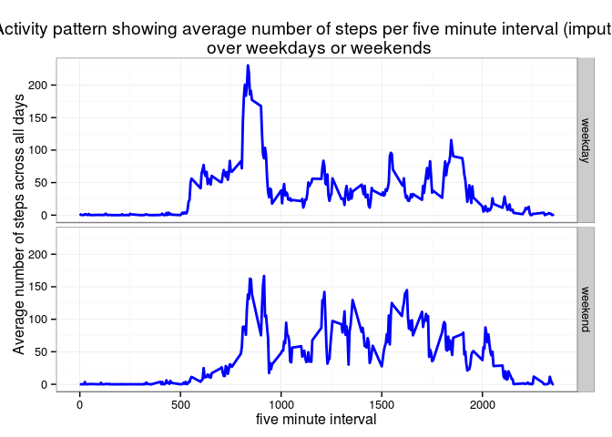

# Reproducible Research: Peer Assessment 1

## Introduction
It is now possible to collect a large amount of data about personal movement using activity monitoring devices such as a Fitbit, Nike Fuelband, or Jawbone Up. These type of devices are part of the "quantified self" movement -- a group of enthusiasts who take measurements about themselves regularly to improve their health, to find patterns in their behavior, or because they are tech geeks. But these data remain under-utilized both because the raw data are hard to obtain and there is a lack of statistical methods and software for processing and interpreting the data.

This assignment makes use of data from a personal activity monitoring device. This device collects data at 5 minute intervals through out the day. The data consists of two months of data from an anonymous individual collected during the months of October and November, 2012 and include the number of steps taken in 5 minute intervals each day. 

The data used is forked and cloned from the github repo http://github.com/rdpeng/RepData_PeerAssessment1

## Loading and preprocessing the data

```r
activity<-read.csv(unz("activity.zip", "activity.csv"))
head(activity)
```

```
##   steps       date interval
## 1    NA 2012-10-01        0
## 2    NA 2012-10-01        5
## 3    NA 2012-10-01       10
## 4    NA 2012-10-01       15
## 5    NA 2012-10-01       20
## 6    NA 2012-10-01       25
```

```r
tail(activity)
```

```
##       steps       date interval
## 17563    NA 2012-11-30     2330
## 17564    NA 2012-11-30     2335
## 17565    NA 2012-11-30     2340
## 17566    NA 2012-11-30     2345
## 17567    NA 2012-11-30     2350
## 17568    NA 2012-11-30     2355
```

The dataset contains 3 variables

- **steps:** Number of steps taking in a 5-minute interval (missing values are coded as NA)
- **date:** The date on which the measurement was taken in YYYY-MM-DD format
- **interval:** Identifier for the 5-minute interval in which measurement was taken

and is stored in a comma-separated-value (CSV) file with a total of 17,568 observations.

To check the structure

```r
str(activity)
```

```
## 'data.frame':	17568 obs. of  3 variables:
##  $ steps   : int  NA NA NA NA NA NA NA NA NA NA ...
##  $ date    : Factor w/ 61 levels "2012-10-01","2012-10-02",..: 1 1 1 1 1 1 1 1 1 1 ...
##  $ interval: int  0 5 10 15 20 25 30 35 40 45 ...
```

###format date
The lubridate package can be used to format the date from Factor to POSIXct format

```r
library(lubridate)
activity$date<-ymd(activity$date)
str(activity)
```

```
## 'data.frame':	17568 obs. of  3 variables:
##  $ steps   : int  NA NA NA NA NA NA NA NA NA NA ...
##  $ date    : POSIXct, format: "2012-10-01" "2012-10-01" ...
##  $ interval: int  0 5 10 15 20 25 30 35 40 45 ...
```

## What is mean total number of steps taken per day?
First calculate the number of steps taken per day

```r
library(dplyr)
```

```
## 
## Attaching package: 'dplyr'
## 
## The following objects are masked from 'package:lubridate':
## 
##     intersect, setdiff, union
## 
## The following objects are masked from 'package:stats':
## 
##     filter, lag
## 
## The following objects are masked from 'package:base':
## 
##     intersect, setdiff, setequal, union
```

```r
totalsteps<-activity%>%
    group_by(date)%>%
    summarise(total = sum(steps))

#calculate the average(mean) and median of the total steps taken each day 
avgtotal<-round(mean(totalsteps$total,na.rm=T),2)
medtotal<-median(totalsteps$total,na.rm=T)
```

Then look at the distribution using a histogram made with ggplot2

```r
library(ggplot2)
qplot(total,data=totalsteps,
      geom="histogram",
      binwidth=2000,
      xlab="Total number of steps taken each day",
      main = "Histogram of total number of steps taken each day",
      fill =I("antiquewhite4"))
```

 

From the above code it can be seen that 

- the average of the total steps taken each day is **10766.19**  
- the median is **10765**.

## What is the average daily activity pattern?
First calculate average steps per 5min interval over the tracked time period


```r
actpattern<-activity%>%
    group_by(interval)%>%
    summarise(avg_steps_interval=mean(steps,na.rm=T),
              med_steps_interval=median(steps,na.rm=T))
```

Then look at the changes in average number of steps per five minute interval

```r
library(scales) #to allowscaling axes
p<-ggplot(aes(interval,avg_steps_interval), data=actpattern) + 
  geom_line(color="blue", size=1) +
  theme_bw() +
  xlab("five minute interval") +
  ylab("Average number of steps across all days") +
  ggtitle("Activity pattern showing average number of steps per five minute interval")
p
```

 

To find the five minute interval with the maximum number of steps, first work out the maximum, then extract which five minute interval it ooccured


```r
max_avg_steps_per_int<-max(actpattern$avg_steps_interval)

#five min interval with average maximum number of steps
max_int<-actpattern[actpattern$avg_steps_interval==max_avg_steps_per_int,"interval"] #835
as.numeric(max_int)
```

```
## [1] 835
```

```r
p<-p+geom_vline(xintercept=as.numeric(max_int),colour="red")
p + annotate("text",x=1150,y=200,label="maximum average number of steps", color="red")
```

 

So the **interval with the maximum number of steps is 835**

## Imputing missing values

I created a function to work out the number of missing values


```r
countnull<-function(s){
    y<-sapply(s,is.na)
    sum(y)
}

#number of missing values
countnull(activity$steps)  #2304
```

```
## [1] 2304
```

```r
countnull(activity$date)  #0
```

```
## [1] 0
```

```r
countnull(activity$interval)  #0
```

```
## [1] 0
```

From this it can be seen that there are  2304 rows with missing data in the dataset.

###Imputation
Missing values are replaced with the average for that interval across all days


```r
#make copy of original data
a_i<-activity

#merge a_i and actpattern
a_i<-left_join(a_i,actpattern,by="interval")

#add average for interval where steps is NA
a_i<-mutate(a_i,
            steps_i=ifelse(is.na(steps),avg_steps_interval,steps))

countnull(a_i$steps_i) #no  NA's remain
```

```
## [1] 0
```

```r
#Create a new dataset that is equal to the original dataset but with the missing data filled in.
a_i<-select(a_i,steps_i,date,interval)
head(a_i)
```

```
##     steps_i       date interval
## 1 1.7169811 2012-10-01        0
## 2 0.3396226 2012-10-01        5
## 3 0.1320755 2012-10-01       10
## 4 0.1509434 2012-10-01       15
## 5 0.0754717 2012-10-01       20
## 6 2.0943396 2012-10-01       25
```

Work out the number of steps per day with imputed data


```r
totalsteps.i<-a_i%>%
  group_by(date)%>%
  summarise(total = sum(steps_i))
```

And plot a histogram


```r
#histogram of total number of steps per day imputed
qplot(total,data=totalsteps.i,
      geom="histogram",
      binwidth=2000,
      xlab="Total number of steps taken each day",
      main = "Histogram of total number of steps taken each day (imputed)",
      fill =I("antiquewhite4"))
```

 


```r
avgtotal.i<-round(mean(totalsteps.i$total,na.rm=T),2)
avgtotal.i
```

```
## [1] 10766.19
```

```r
medtotal.i<-median(totalsteps.i$total,na.rm=T)
medtotal.i
```

```
## [1] 10766.19
```

From this the mean of the total number of steps in imputed data is **10766.19** compared to the original of **10766.19** and the median in imputed data is **10766.19** compared to the original **10765**.

So imputation in this way did not make much difference except for shifting the median slightly to be equal to the mean.

## Are there differences in activity patterns between weekdays and weekends?

First create the wkday variable to identify weekdays and weekends

```r
library(lubridate)
a_i<-mutate(a_i,
            wkday = ifelse(wday(date) %in% 2:6,"weekday","weekend"))
```

Then calculate the activity pattern each five minute interval for both weekdays and weekends


```r
actpattern.i<-a_i%>%
    group_by(interval,wkday)%>%
    summarise(avg_steps_interval=mean(steps_i,na.rm=T),
              med_steps_interval=median(steps_i,na.rm=T))
```

Now we can look at activity pattern by wkday variable


```r
p.i<-ggplot(aes(interval,avg_steps_interval), data=actpattern.i) + 
    geom_line(color="blue", size=1) +
    theme_bw() +
    facet_grid(wkday~.) +
    xlab("five minute interval") +
    ylab("Average number of steps across all days") +
    ggtitle("Activity pattern showing average number of steps per five minute interval (imputed) \n over weekdays or weekends")
p.i
```

 

